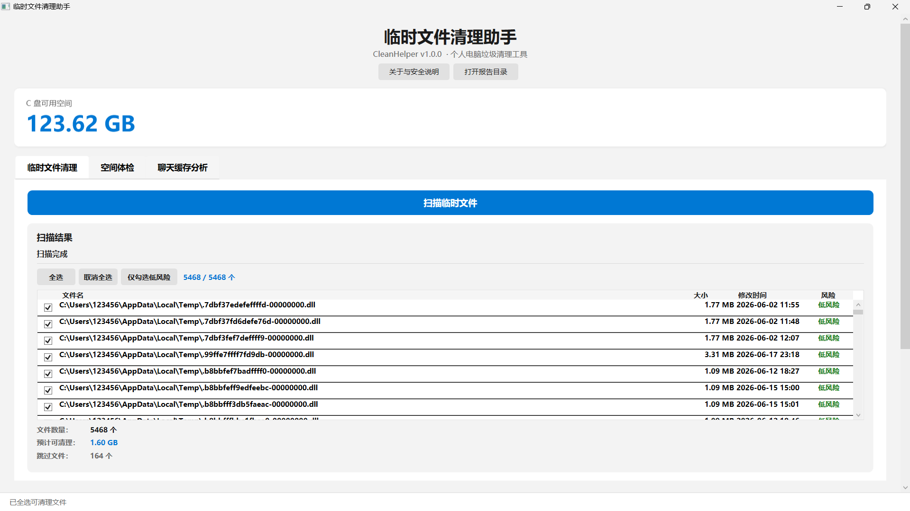
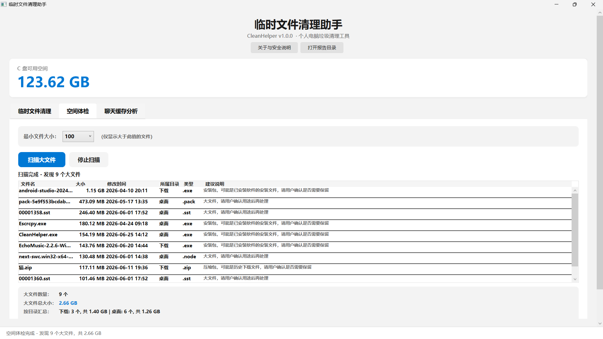
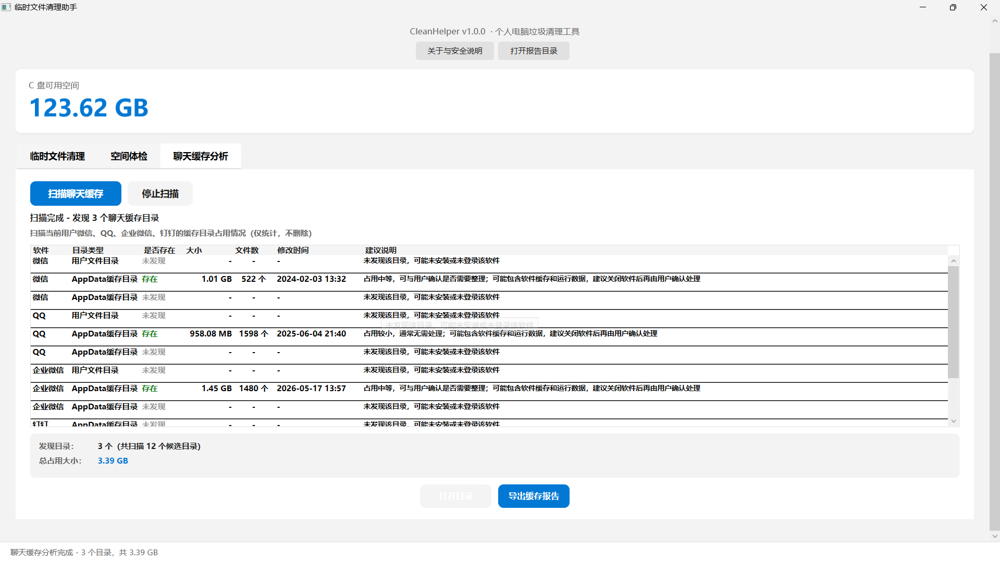

# CleanHelper（临时文件清理助手）

> Windows 个人电脑垃圾清理工具 · 安全 · 离线 · 无广告

[](https://dotnet.microsoft.com/)
[](https://github.com/dotnet/wpf)
[](LICENSE)

---

## 功能介绍

### 🧹 临时文件清理

一键扫描 `%TEMP%` 目录中的临时文件，按修改时间自动风险分级：

| 风险等级 | 条件 | 默认行为 |
|----------|------|----------|
| 低风险 | 7 天前修改 | 自动勾选 |
| 中风险 | 7 天内修改 | 不勾选，需手动确认 |
| 无法清理 | ReparsePoint / 无权限 | 灰显不可选 |

- 支持全选、取消全选、一键勾选低风险
- 清理前确认弹窗，支持撤销前的最后确认
- 多次路径安全校验，确保只在 `%TEMP%` 内操作
- 显示**成功处理大小**与**真实释放空间**两个独立统计维度

### 📊 空间体检

扫描用户目录中的大文件，帮助发现硬盘空间消耗点（仅分析，不删除）：

- 扫描范围：下载、桌面、文档、图片、视频、音乐
- 按最小文件大小筛选（50/100/500/1000 MB）
- 按目录分类汇总 + 建议说明
- 支持"打开文件所在位置"快速定位

### 💬 聊天缓存分析

统计微信、QQ、企业微信、钉钉的缓存目录占用情况（仅统计，不读取聊天内容）：

- 扫描 12 个候选缓存目录
- 显示每个目录的大小、文件数、最后修改时间
- 按软件汇总占用排行
- 按目录大小给出整理建议

### 📝 报告系统

三种报告类型，均可导出为 UTF-8 纯文本文件：
- 临时文件清理报告
- 空间体检报告
- 聊天缓存分析报告

所有报告仅包含文件元数据（路径、大小、时间），不包含文件内容。

---

## 安全承诺

| 承诺 | 说明 |
|------|------|
| 🔌 不联网 | 零网络请求，Windows Defender 防火墙可验证 |
| 📤 不上传 | 不读取文件内容，不向任何服务器发送数据 |
| 🚫 不常驻 | 关闭即退出，无后台进程 |
| ⚙️ 不安装服务 | 无 Windows Service、无自启动 |
| 📁 不碰系统目录 | 不清理 `Windows`、`Program Files`、注册表 |
| 👁️ 不窥探隐私 | 聊天缓存分析只统计大小，不读取聊天内容 |

---

## 技术栈

| 类别 | 技术 |
|------|------|
| 语言 | C# 12 |
| 框架 | .NET 8.0 |
| UI | WPF (Windows Presentation Foundation) |
| 架构 | MVVM（Model-View-ViewModel） |
| 数据绑定 | ObservableCollection + INotifyPropertyChanged |
| 命令 | RelayCommand（ICommand 实现） |
| 接口 | 5 个服务接口（依赖倒置） |
| 日志 | 文件日志（`logs/clean_yyyyMMdd.log`） |

### 项目结构

```
CleanHelper/
├── App.xaml                  # 应用入口 + 全局资源
├── MainWindow.xaml           # 主窗口界面
├── Models/
│   ├── FileScanInfo.cs       # 扫描文件模型
│   ├── ScanResult.cs         # 扫描结果模型
│   ├── CleanResult.cs        # 清理结果模型
│   ├── LargeFileInfo.cs      # 大文件模型
│   └── ChatCacheInfo.cs      # 聊天缓存模型
├── ViewModels/
│   ├── MainViewModel.cs      # 主视图模型（核心业务逻辑）
│   └── RelayCommand.cs       # 通用命令绑定
├── Services/
│   ├── TempFileScanner.cs    # 临时文件扫描
│   ├── TempFileCleaner.cs    # 临时文件清理
│   ├── LargeFileScanner.cs   # 大文件扫描
│   ├── ChatCacheScanner.cs   # 聊天缓存扫描
│   ├── Logger.cs             # 文件日志
│   └── I*.cs                 # 服务接口
├── Converters/
│   └── BoolConverters.cs     # 布尔值转换器
└── Helpers/
    └── FileSizeFormatter.cs  # 文件大小格式化
```

---

## 下载

请前往 [Releases](https://github.com/uangh66/CleanHelper/releases) 下载最新版本：

- **Latest Release**: https://github.com/uangh66/CleanHelper/releases/latest
- **推荐下载**：`CleanHelper-v1.0.0-win-x64.zip`

下载后解压，双击 `CleanHelper.exe` 即可运行。

> 说明：本项目为个人开源工具，未进行代码签名。首次运行时 Windows Defender / SmartScreen 可能出现安全提示，请确认来源后选择"仍要运行"。如不放心，可从源码自行构建。

---

## 快速开始

### 运行环境

- Windows 10 / 11 (x64)
- [.NET 8.0 Desktop Runtime](https://dotnet.microsoft.com/en-us/download/dotnet/8.0)（从源码构建时需要）

### 从源码构建

```bash
git clone https://github.com/uangh66/CleanHelper.git
cd CleanHelper
dotnet run
```

### 发布单文件

```bash
dotnet publish -c Release -o publish
# 输出: publish/CleanHelper.exe（单文件，免安装）
```

---

## 截图








---

## 开发说明

- 项目遵循 MVVM 架构，View 层不包含业务逻辑
- 所有文件操作均包含路径安全校验和异常处理
- 修改代码后请执行 `dotnet build` 确认编译通过
- 详细信息见 [CLAUDE.md](CLAUDE.md)

---

## 关于作者

本项目由 **黄锐 (Huang Rui)** 独立开发并开源。

开发过程中使用了 Claude、DeepSeek 等 AI 工具辅助需求拆解、代码生成、调试与文档整理。所有 AI 生成代码均经过人工审查与测试验证。

---

## License

MIT
